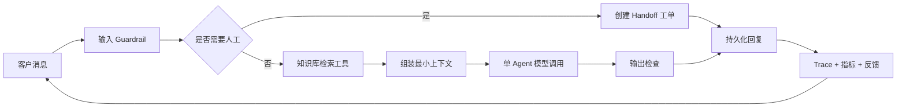

# 通用智能客服 Agent 架构

更新日期：2026-07-18

## 结论

客服系统的默认最佳形态不是“多个 Agent 自由讨论”，而是 **确定性工作流包裹一个有界 Agent**：

- 程序负责安全检查、知识检索、状态持久化、人工转接、审计与反馈；
- 模型负责理解自然语言、综合上下文和生成回复；
- 有副作用的动作通过类型明确的工具执行，并按风险设置审批；
- 只有当不同岗位确实拥有不同指令、工具和权限时，才拆分专门 Agent。

OpenAI 将 Agent 的核心能力归纳为工具、状态、handoff、guardrail、审批和 trace；Anthropic 建议从最简单的方案开始，优先使用可预测工作流，只在任务确实需要灵活决策时增加自治；LangGraph 强调持久状态、可恢复执行和 human-in-the-loop。

参考资料：

- [OpenAI Agents SDK](https://developers.openai.com/api/docs/guides/agents)
- [OpenAI Using tools](https://developers.openai.com/api/docs/guides/tools)
- [OpenAI Integrations and observability](https://developers.openai.com/api/docs/guides/agents/integrations-observability)
- [Anthropic Building effective agents](https://www.anthropic.com/engineering/building-effective-agents)
- [LangGraph persistence](https://docs.langchain.com/oss/python/langgraph/persistence)
- [LangGraph human-in-the-loop](https://docs.langchain.com/oss/python/langchain/human-in-the-loop)

## 本项目采用的运行图

每个节点都有清晰责任：

1. **Guardrail**：限制输入长度，识别显式人工请求、高风险投诉和提示注入迹象。
2. **Triage**：明确需要人工时走确定性分支，不让模型决定是否真的创建工单。
3. **Knowledge tool**：本地 BM25 检索，返回片段、来源和置信度。
4. **Context engineering**：只注入相关片段，并把知识内容标记为不可信数据而不是指令。
5. **Agent response**：一次模型调用完成自然语言回答，控制延迟和成本。
6. **Handoff**：保存完整会话标识、原因和摘要，供人工继续处理。
7. **Observability**：记录每次运行的路由、检索分数、模型、时延、token、错误和阶段事件。
8. **Feedback**：客户赞/踩与 Trace 绑定，形成可重复评测的数据入口。

## 为什么当前不直接引入多 Agent

知识问答、政策说明和基础分流都属于边界清晰的客服工作。多 Agent 会增加调用次数、延迟、成本、调试难度和不可预测性，却不会自然提高知识准确率。

未来只有在以下情况才拆分：

- 售前、售后、技术支持具有完全不同的知识库和工具权限；
- 退款、改价、发货等动作需要不同审批链；
- 单一提示词已经难以维持清晰职责；
- 离线评测证明拆分后的成功率收益高于新增成本。

拆分时优先使用“主管 Agent 把专家当工具”，让主管保持回复所有权；只有需要把整段会话正式转交给另一个岗位时才用 handoff。

## 工具和审批边界

| 工具 | 类型 | 默认策略 |
|---|---|---|
| `knowledge_search` | 只读 | 自动执行 |
| `request_human_handoff` | 有限写入 | 用户明确要求或高风险规则命中时执行 |
| 查询订单/物流 | 只读外部 API | 验证用户身份后自动执行 |
| 退款、取消、改地址 | 有副作用 | 必须人工批准，可暂停和恢复 |

第三方 API 工具应使用固定域名白名单、严格 JSON Schema、短超时、幂等键和脱敏日志，不能让模型提交任意 URL 或任意 HTTP 请求。

## 数据与运行边界

- SQLite 适合当前单机开发；正式多实例部署改用 PostgreSQL。
- 会话历史由服务器保存，前端只持有不可猜测的会话 ID。
- Trace 不记录 API Key；涉及个人信息时应设置保留周期和删除接口。
- 人工转接必须附带会话上下文，人工处理状态应可追踪。
- 生产环境需要管理员鉴权、客户身份、限流、HTTPS 和后台任务队列。

## 评测闭环

上线前至少维护以下测试集：

- 有知识且答案明确；
- 没有知识时拒绝编造；
- 明确要求人工客服；
- 投诉、法律、安全等高风险请求；
- 知识库中的提示注入文本；
- 多轮追问和会话恢复；
- 上游超时、限流和无效模型。

核心指标包括知识命中率、答案正确率、转人工率、误转率、平均时延、单次 token、客户反馈和人工最终处理结果。
